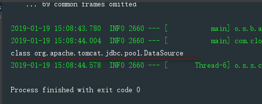

# ***SpringBoot应用JDBC***

#### **1.引入依赖**
```pom
<dependencies>
    <!-- JDBC -->
    <dependency>
        <groupId>org.springframework.boot</groupId>
        <artifactId>spring-boot-starter-jdbc</artifactId>
    </dependency>

    <!-- Mysql驱动 -->
    <dependency>
        <groupId>mysql</groupId>
        <artifactId>mysql-connector-java</artifactId>
        <scope>runtime</scope>
    </dependency>
</dependencies>
```

#### **2.配置JDBC数据源**
* <font color= red size = 5>SpringBoot2.0开始默认使用HikariDataSource,要将数据源切换为其他数据源,需引入该数据源的依赖</font>
* 引入tomcat数据源依赖
```pom
<dependency>
    <groupId>org.apache.tomcat</groupId>
    <artifactId>tomcat-jdbc</artifactId>
    <version>9.0.13</version>
</dependency>
```
* yml文件配置
```yml
  spring:
    datasource:
      driver-class-name: com.mysql.jdbc.Driver
      url: jdbc:mysql://localhost://3306/springboot-jdbc?useSSL=false&useUnicode=true&characterEncoding=utf8mb4&serverTimezone=GMT%2B8
      username: root
      password: '123456'
      type: org.apache.tomcat.jdbc.pool.DataSource
```
* 测试数据源切换
   * ```java
     @RunWith(SpringJUnit4ClassRunner.class)
     @SpringBootTest
     public class JdbcTest {

         @Autowired
         DataSource dataSource;

         @Test
         public void dataSourceTest(){
             System.out.println(dataSource.getClass());
         }
     }
     ```
   * 结果

   

# ***SpringBoot应用在启动时创建数据库表***
* 在resource创建SQL文件夹
* 修改配置文件
```yml
spring:
  datasource:
    driver-class-name: com.mysql.cj.jdbc.Driver
    url: jdbc:mysql://localhost:3306/springboot-jdbc?useUnicode=true&characterEncoding=utf8&serverTimezone=GMT%2B8
    username: root
    password: '123456'
    schema:
      - classpath:sql/department.sql
      - classpath:sql/employee.sql
    initialization-mode: never  #此处为springboot2.0后的新特性,必须加,只要应用启动就会重新创建表
```

# ***SpringBoot应用使用JdbcTemplate操作数据库***
* 使用jdbcTemplate操作数据库